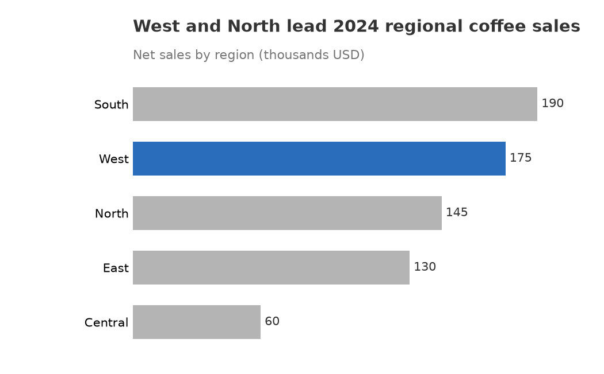
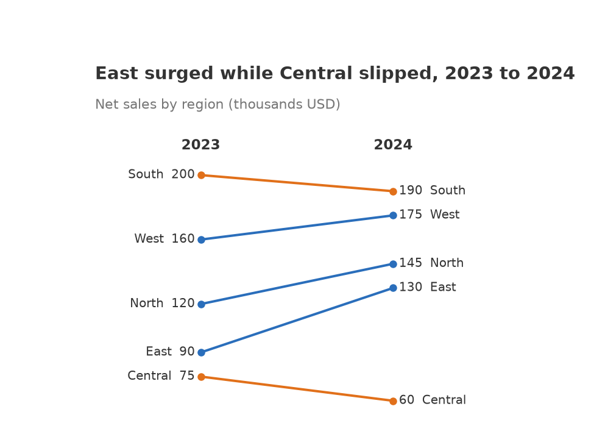

# simple-eda-yzheng74

A tiny **visualization + EDA** library for pandas DataFrames (MSDS610). Every
chart follows the Evergreen & Emery *Data Visualization Checklist* by default.

- **Install name** (pip): `simple-eda-yzheng74`
- **Import name** (Python): `simple_eda`

## Install

```bash
pip install simple-eda-yzheng74          # from PyPI (once published)
```

From a local clone (development):

```bash
git clone https://github.com/399441537/msds610.git
cd msds610
pip install -e ".[dev]"
```

## Functions

Visualizations (each returns a Matplotlib `Axes`):

- `bar(df, category, value, *, title, subtitle=None, highlight=None)`
- `lollipop(df, category, value, *, title, subtitle=None, highlight=None)`
- `slopegraph(df, category, start, end, *, title, subtitle=None, start_label, end_label)`

EDA helpers (each takes a DataFrame, returns a plain Python object):

- `summarize(df)` → dict · `missing(df)` → dict
- `numeric_columns(df)` → list · `categorical_columns(df)` → list

Data: `load_sample()` → a sample sales DataFrame (also at
[`examples/sample_data.csv`](examples/sample_data.csv)).

```python
from simple_eda import load_sample, bar
df = load_sample()
ax = bar(df, "region", "sales_2024",
         title="West and North lead 2024 regional coffee sales",
         subtitle="Net sales by region (thousands USD)", highlight="West")
ax.figure.savefig("bar.png", dpi=150)
```

## My two favorite visualizations

### 1. Horizontal bar — `bar()`



- **Horizontal bars** keep category labels upright and readable.
- **Sorted largest-to-smallest** so the ranking is the shape of the chart.
- **Values labeled directly** on the bars, so the x-axis and gridlines are gone.
- **One blue highlight** against **muted gray** points the eye at the takeaway,
  and it stays legible in black & white.
- A **descriptive, left-justified title** states the finding, not "Sales by region."

### 2. Slopegraph — `slopegraph()`



- **Two anchors connected by a line** — the slope encodes direction and size of
  change with almost no ink.
- **Both ends labeled directly**, so there is no legend or axis to read.
- **Blue = up, orange = down** (colorblind-safe; also clear in grayscale because
  the lines physically slope).
- **Thin muted lines** keep it calm; the title carries the conclusion.

## Tests

```bash
pip install -e ".[dev]"
pytest
```

## Publishing (TestPyPI → PyPI)

```bash
python -m build                                       # wheel + sdist into dist/
python -m twine check dist/*                          # validate
python -m twine upload --repository testpypi dist/*   # TestPyPI first
python -m twine upload dist/*                         # then real PyPI
```

Uploading requires a PyPI / TestPyPI account and an API token.
